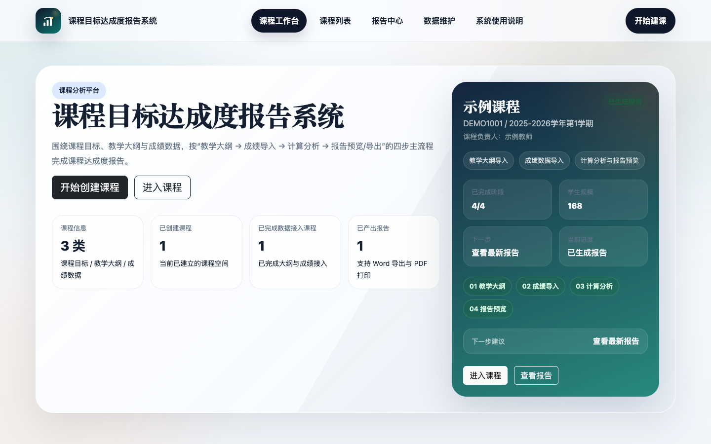
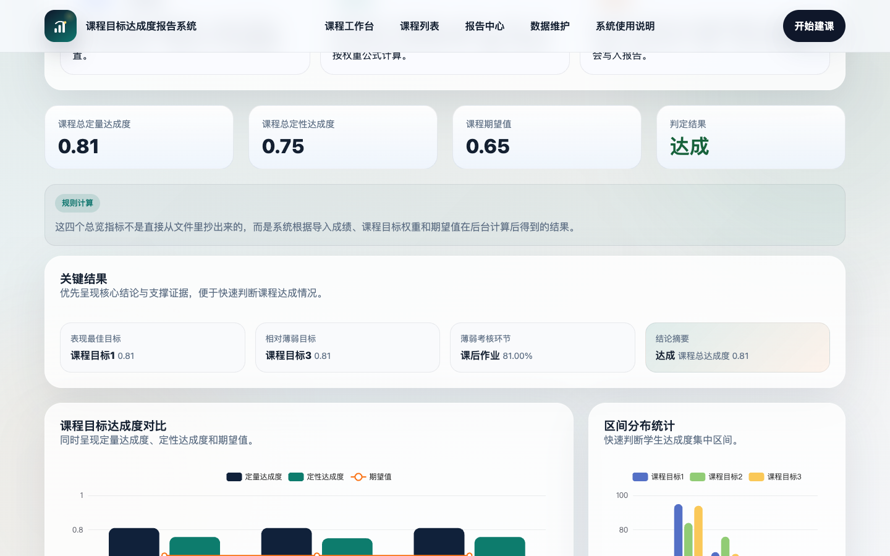
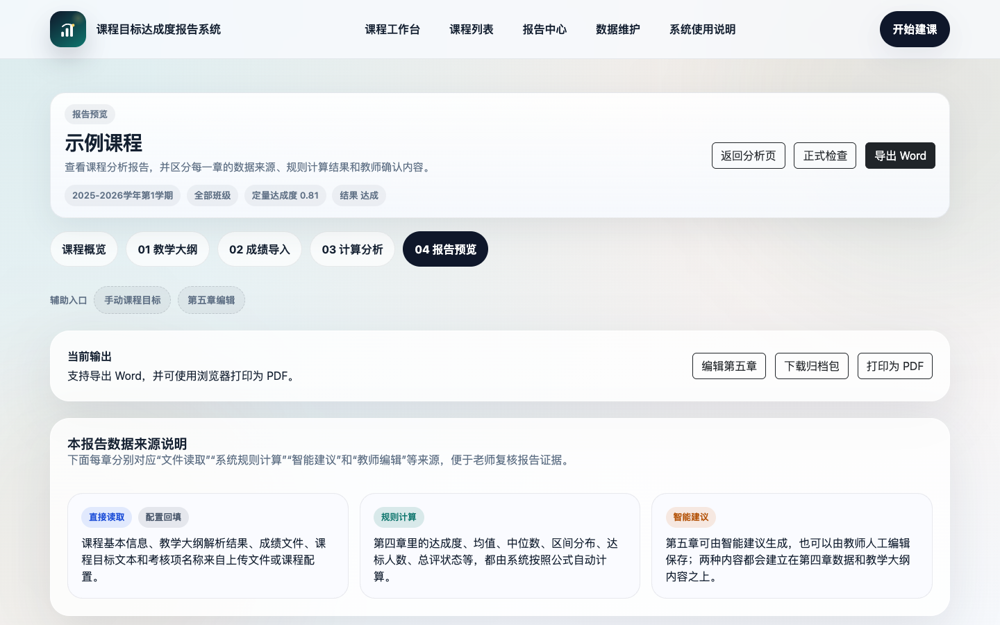

# Course Attainment Report System

English | [中文](README.zh-CN.md)

A local web system for course objective attainment analysis, report generation, and evidence archiving. It connects syllabi, course objectives, assessment weights, student scores, analysis results, report versions, and archive packages into a traceable workflow for course evaluation and continuous improvement.

## Screenshots







## Features

- Course management: maintain course metadata, objectives, graduation requirement indicators, and assessment weights.
- Syllabus parsing: extract course information, objective descriptions, requirement mappings, and assessment support relationships from `.docx` syllabi.
- Score import precheck: supports `.xls/.xlsx/.xlsm/.csv` and multiple class files in one import; the system previews student count, classes, sheets, column mappings, and score issues before writing to the database.
- Attainment analysis: calculates quantitative attainment, qualitative attainment, statistical indicators, passing counts, distribution bands, and overall course attainment.
- Manual revision: adjust qualitative counts and explanatory notes on the analysis page, then reuse those revisions in the report.
- Chapter 5 editing: generate improvement suggestions with an optional LLM integration, or edit and save the text manually.
- Report export and archive: preview reports, export Word files, keep report versions, archive final versions, and compare adjacent versions.
- Report quality check: checks course owner, objectives, score data, chapter 4 calculation, chapter 5 text, and archive status before export or final archive.
- Course archive package: exports a course evidence package with analysis summary, quality check result, syllabus parsing result, import logs, analysis snapshots, and generated Word reports.
- Backup and restore: create system backup packages from the Data Maintenance page and preserve the current database before restore.

## Typical Workflow

1. Create a course and fill in basic course information.
2. Upload a syllabus and review parsed objectives, indicators, and assessment mappings.
3. Upload one or more class score files, run the precheck, and confirm the import.
4. Run attainment calculation on the analysis page and revise results when needed.
5. Edit chapter 5 evaluation and improvement content.
6. Preview the report and run the report quality check.
7. Export the Word report, archive the final version, or download the course archive package.

## Tech Stack

- Backend: Python, Flask, SQLAlchemy, WTForms
- Frontend: Jinja2, Bootstrap 5, ECharts, Mermaid
- Data processing: pandas, openpyxl
- Document export: python-docx
- Database: SQLite

## Quick Start

```bash
python -m venv .venv
source .venv/bin/activate
pip install -r requirements.txt
python init_db.py
python app.py
```

Open `http://127.0.0.1:5000`.

On first startup, the system creates an administrator account. The default username is `admin`, and the default password is `admin123`. The system requires changing the initial password before entering course data pages. For real deployment, configure a temporary strong password through environment variables.

`python init_db.py` only creates database tables by default. It does not delete existing data or write demo courses.

To reset the local SQLite database and load sanitized demo data:

```bash
python init_db.py --reset-demo
```

Before resetting, the script backs up the old database as a `.bak` file.

## Optional Environment Variables

LLM-based suggestions are optional. Course creation, score import, attainment calculation, manual editing, and report export work without an LLM key.

```bash
export SECRET_KEY="replace-with-a-random-local-secret"
export COURSE_SYSTEM_DATA_DIR="/Users/your-name/course-system-data"
export DEFAULT_ADMIN_USERNAME="admin"
export DEFAULT_ADMIN_PASSWORD="replace-with-a-temporary-strong-password"
export LLM_API_BASE="https://api.deepseek.com"
export LLM_API_KEY="your-model-service-key"
export LLM_MODEL="deepseek-v4-flash"
export LLM_TIMEOUT="45"
```

`LLM_TIMEOUT` is measured in seconds.

## Data And Privacy

This repository should contain only source code, templates, and sanitized samples. The following content is excluded by `.gitignore` and the release packaging script:

- `.env`, API keys, database files, and backup files
- `instance/`, `uploads/`, `exports/`, `datasoruce/`, `tmp/`, `output/`
- Real syllabi, score sheets, student information, and exported reports
- Local virtual environments, browser binaries, IDE settings, and caches

For deployment, set `COURSE_SYSTEM_DATA_DIR` so databases, uploads, reports, and backups live outside the source directory. In a fresh environment, the system uses `var/` by default; if a legacy `instance/attainment_system.db` already exists, the system keeps the legacy path to avoid hiding existing courses after upgrade.

## Release Package

Create a release package without real course data:

```bash
python scripts/build_release.py
```

The archive is written to `dist/course-system-release.zip` by default. It excludes databases, uploads, exported reports, real score and syllabus files, local helper scripts, and local caches.

## Tests

```bash
python scripts/run_tests.py
```

If local course test files are available, you can also run:

```bash
python -m unittest tests/test_algorithm_outline_and_multi_import.py
```

## Project Structure

```text
coursesystem/
├── app.py
├── config.py
├── forms.py
├── init_db.py
├── models.py
├── routes/
├── services/
├── static/
├── templates/
├── sample_data/
├── docs/
├── tests/
└── README.md
```

Runtime directories such as `uploads/`, `exports/`, and `instance/` are created automatically. When `COURSE_SYSTEM_DATA_DIR` is configured, they are created under that data directory instead.

## More Documentation

- [Deployment And Usage Guide](docs/部署与使用说明.md)
- [Sample Data Guide](sample_data/README.md)
- [Contribution Guide](CONTRIBUTING.md)
- [Changelog](CHANGELOG.md)
