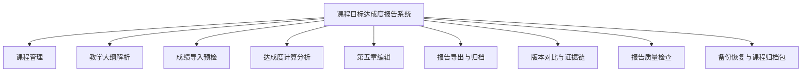

# 课程目标达成度报告系统

面向高校课程负责人和教学管理场景的本地化课程达成度分析工具。系统围绕“教学大纲、课程目标、考核项权重、学生成绩、持续改进报告”建立一条可追溯的数据链，帮助使用者完成课程目标达成度计算、报告归档和多轮结果对比。

## 主要功能

- 课程管理：维护课程基本信息、课程目标、毕业要求指标点和考核项权重。
- 教学大纲解析：从 `.docx` 教学大纲中提取课程信息、目标描述、毕业要求映射和考核支撑关系。
- 成绩导入预检：支持 `.xls/.xlsx/.xlsm/.csv`，可一次选择多个班级文件；系统先预检学生数、班级、工作表、列映射和分值异常，确认后才写入数据库。
- 达成度分析：计算课程目标定量达成度、定性达成度、统计特征、达标人数、区间分布和课程总达成度。
- 人工修订：可在计算分析页调整定性评价计数和说明，修订内容会写入报告。
- 第五章编辑：可使用智能建议生成评价与改进措施，也可由教师手工编辑并同步到报告。
- 报告导出与归档：支持报告预览、Word 导出、版本记录、最终版归档和相邻版本对比。
- 报告质量检查：在正式导出或归档前检查课程负责人、课程目标、成绩数据、第四章计算、第五章内容和报告归档状态。
- 课程归档包：一键导出课程证据包，包含分析摘要、质量检查结果、教学大纲解析、导入日志、分析快照和已生成 Word 报告。
- 数据备份与恢复：在“数据维护”页面创建系统备份包，备份数据库、上传文件和报告文件；恢复前会自动保存当前数据库副本。
- 导入日志与证据链：保留文件名、工作表、文件指纹、导入前后学生数、清理旧数据数量和异常摘要。

## 技术栈

- 后端：Python、Flask、SQLAlchemy、WTForms
- 前端：Jinja2、Bootstrap 5、ECharts、Mermaid
- 数据处理：pandas、openpyxl
- 文档导出：python-docx
- 数据库：SQLite

## 快速开始

```bash
python -m venv .venv
source .venv/bin/activate
pip install -r requirements.txt
python init_db.py
python app.py
```

访问：`http://127.0.0.1:5000`

首次启动会自动创建管理员账号，默认账号为 `admin`，默认密码为 `admin123`。系统会强制先修改初始密码，修改完成后才能进入课程数据页面。实际部署时建议通过环境变量设置初始账号和随机强密码。

`python init_db.py` 默认只创建表结构，不会删除现有数据库，也不会写入样例课程。

如确实需要重置本地 SQLite 并写入内置样例数据：

```bash
python init_db.py --reset-demo
```

执行重置时，脚本会先把旧数据库备份为 `.bak` 文件。

## 可选环境变量

智能建议功能是可选的。未配置模型密钥时，系统的建课、导入、计算、手工编辑、报告导出均可正常使用。

```bash
export SECRET_KEY="请替换为本机随机字符串"
export COURSE_SYSTEM_DATA_DIR="/Users/你的用户名/course-system-data"
export DEFAULT_ADMIN_USERNAME="admin"
export DEFAULT_ADMIN_PASSWORD="请替换为临时强密码"
export LLM_API_BASE="https://api.deepseek.com"
export LLM_API_KEY="你的模型服务密钥"
export LLM_MODEL="deepseek-v4-flash"
export LLM_TIMEOUT="45"
```

`LLM_TIMEOUT` 的单位是秒。

## 数据与隐私

本仓库只应提交源代码、模板和脱敏样例。以下内容默认被 `.gitignore` 排除：

- `.env`、API Key、数据库文件和备份文件
- `instance/`、`uploads/`、`exports/`、`datasoruce/`、`tmp/`、`output/`
- 真实课程教学大纲、成绩表、学生信息和导出的报告
- 本地虚拟环境、浏览器二进制、IDE 配置和缓存

部署使用时，建议设置 `COURSE_SYSTEM_DATA_DIR`，让数据库、上传文件、报告和备份都放在源码目录之外。新安装环境未设置该变量时，系统会优先使用 `var/` 作为运行数据目录；如果检测到旧版 `instance/attainment_system.db` 已存在，则保持旧目录兼容，避免升级后看不到原有课程。每台电脑或每个教学团队使用独立数据目录，并通过“数据维护”页面定期创建备份包。恢复备份时需要输入“确认恢复”，系统会先创建一份完整备份再替换当前数据。

生成不含真实课程数据的系统发布包：

```bash
python scripts/build_release.py
```

发布包默认写入 `dist/course-system-release.zip`，会自动排除数据库、上传文件、导出报告、真实成绩和教学大纲、论文辅助脚本、本地缓存等内容。

## 目录结构

```text
coursesystem/
├── app.py
├── config.py
├── forms.py
├── init_db.py
├── models.py
├── routes/
├── services/
├── static/
│   ├── css/
│   ├── js/
│   └── vendor/
├── templates/
├── sample_data/
├── tests/
└── README.md
```

运行时目录如 `uploads/`、`exports/`、`instance/` 会由系统自动创建；设置 `COURSE_SYSTEM_DATA_DIR` 后，这些目录会迁移到指定数据目录下。

## 测试

```bash
python scripts/run_tests.py
```

如果本机保留了课程测试文件，也可以运行：

```bash
python -m unittest tests/test_algorithm_outline_and_multi_import.py
```

## 功能模块图



## 典型流程


